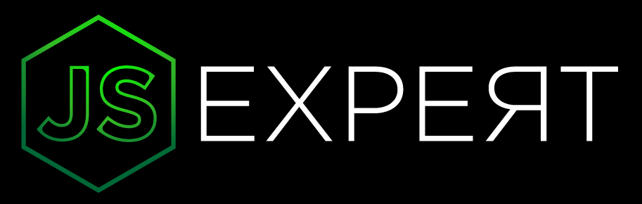

  

  

  

  

    <h1>Aquecimento Semana Javascript Expert 1</h1>

<h1 align="center">
    
</h1>

## ℹ Sobre este repositório

Este repositório tem como objetivo armazenar os exerícios e exemplos introduzidos durante as lives que antecederam o evento _Semana Javascript Expert 1ª Edição_, realizado por [Erick Wendel](https://github.com/ErickWendel).

## 👨‍💻 Lives

- [x] Live 01: [Os segredos da Sintaxe Javascript](https://www.youtube.com/watch?v=DiqLe0nDekA)
- [ ] Live 02: [Entendendo o contexto this, Closures, IIFE e o Objeto Proxy em JS](https://www.youtube.com/watch?v=tGSpqjerR_U)
- [ ] Live 03: [Trabalhando com Test Driven Development na vida real](https://www.youtube.com/watch?v=9COpZuJzx18&t=707s)
- [ ] Live 04: [O que você não sabia sobre Promises em Javascript](https://www.youtube.com/watch?v=40kiPpRoH0A)
- [ ] Live 05 [Generators e Iterators na prática](https://www.youtube.com/watch?v=w_UE-wTZPpM)
